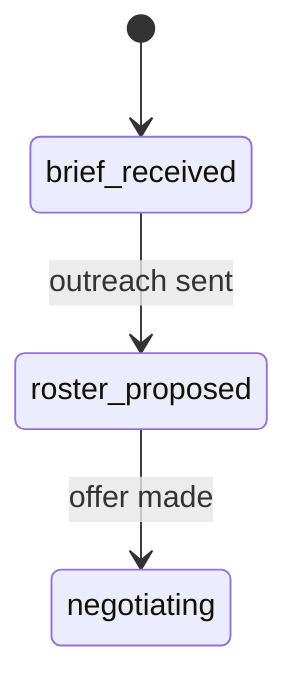

# Diagrams in design artifacts

Read this before drawing anything in a design discussion, PRD or TDD.

## When a diagram earns its place

A diagram is worth drawing when it lets a cold reader see a **mechanism** they would otherwise have
to assemble from prose: where data flows, which components talk, what changes between two options,
what states something moves through.

**If a sentence says it faster, write the sentence.** A diagram that restates the headings adds
nothing and still has to be maintained.

Three rules that decide whether a diagram is any good:

- **Draw the mechanism, not its name.** A box labelled "resolver" says less than the prose. The rows
  going in, the branch that picks a stage, and the party that comes out say what words cannot.
- **Comparing options? Draw the difference.** Two separate labelled boxes, one per option, is a
  restated option list. Show the one edge each option adds or removes, so the reader can point at
  what they are choosing between.
- **Label the arrows.** An unlabelled arrow means "related somehow". `writes`, `invalidates`,
  `polls every 30s` is information.

Match complexity to the stakes. A one-hop question is three boxes. A migration that reroutes writes
through a queue needs the queue, the writer, the reader and the ordering arrow.

## Use Mermaid, fenced in the artifact

Put the diagram **inline in the markdown**, not in a separate file:

````

````

Inline beats a separate file for three reasons, all of which matter more than they sound:

1. **It renders where review actually happens.** GitHub renders ```mermaid fences in markdown, so a
   reviewer reading the PR sees the picture. A linked HTML file is a download they will skip.
2. **It diffs as text.** Changing one edge shows up as one changed line, so a reviewer can see what
   moved between versions.
3. **It cannot drift.** A diagram in the document it explains is edited with that document. A
   separate file silently goes stale.

Check the rendering target before assuming: not every viewer renders Mermaid. If the artifact is
mainly read somewhere that does not, say so and keep the diagram simple enough to read as source.

## Which diagram for which question

| The question | Type | Use it for |
|---|---|---|
| What states does this move through? | `stateDiagram-v2` | Lifecycles, status ladders, anything with terminal states |
| Who calls whom, in what order? | `sequenceDiagram` | API interactions, call paths, handshakes, retries |
| How do the pieces connect? | `flowchart LR` / `TD` | Architecture, data flow, component boundaries |
| What is the data shape? | `erDiagram` | Schemas, table relationships, cardinality |
| What types relate how? | `classDiagram` | Program design: interfaces, inheritance, composition |

## By phase

**Design discussion (RPI).** The two that earn their place here are *current state vs desired state*,
and *the difference between the options under discussion*. Draw the delta, not two unrelated
pictures.

**PRD.** The user's path through the change, as a `flowchart` or `stateDiagram-v2`. Behaviour, not
implementation: no services, no tables, no function names. If the argument is about **visual
layout**, Mermaid is the wrong tool, see below.

**TDD, system design.** This is where diagrams pay for themselves most, because the problems visible
here are invisible later: a `sequenceDiagram` exposes an extra round trip, an `erDiagram` exposes a
missing index or an N+1. Draw contracts, stores, queues and the queries against them.

**TDD, program design.** Call paths as `sequenceDiagram`, type relationships as `classDiagram`. Only
where the shape is not obvious from the signatures already written down.

## The exception: UI mockups

Mermaid cannot draw an interface. When the argument is about **layout, hierarchy or visual
treatment**, write a self-contained HTML file instead:

```
<task dir>/mockup-<description>.html
```

Link it from the artifact. Keep it to one screen per file, and label it as a mockup so nobody mistakes
it for a spec. This is the only case where a separate file is the right answer.

## Keep them honest

- One diagram, one claim. Two ideas means two diagrams.
- Put the explanatory sentence in a caption under the diagram, not inside a node label.
- Node labels are a word or three. Prose belongs in prose.
- If a diagram needs a legend to be read, it is probably doing two jobs.
- A diagram that contradicts the text beside it is worse than no diagram, because a reader will
  believe the picture. When you change the text, change the diagram.
